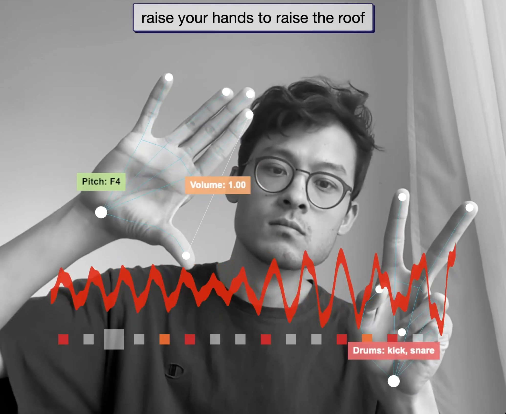

# Hand Gesture Arpeggiator

Hand-controlled arpeggiator, drum machine, and audio reactive visualizer. Raise your hands to raise the roof!

An interactive web app built with threejs, mediapipe computer vision, rosebud AI, and tone.js.

- Hand #1 controls the arpeggios (raise hand to raise pitch, pinch to change volume)
- Hand #2 controls the drums (raise different fingers to change the pattern)




## Requirements

- Modern web browser with WebGL support
- Camera access enabled for hand tracking

## Technologies

- **MediaPipe** for hand tracking and gesture recognition
- **Three.js** for audio reactive visual rendering
- **Tone.js** for synthesizer sounds
- **HTML5 Canvas** for visual feedback
- **JavaScript** for real-time interaction

## Setup for Development

```bash
# Clone this repository
git clone "link"

# Navigate to the project directory
cd arpeggiator

# Serve with your preferred method (example using Python)
python -m http.server
```

Then navigate to `http://localhost:8000` in your browser.


## Credits

- Three.js - https://threejs.org/
- MediaPipe - https://mediapipe.dev/
- Rosebud AI - https://rosebud.ai/
- Tone.js - https://tonejs.github.io/


